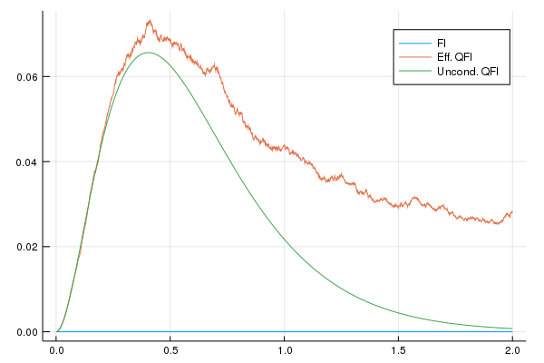

# ContinuousMeasurementFI
[](https://arxiv.org/abs/1803.05891)
[](https://zenodo.org/badge/latestdoi/119356448)

Fisher information for magnetometry with continuously monitored spin systems, with independent Markovian noise acting on each spin. The algorithm is described in Sec. V of the paper available on [the arXiv](https://arxiv.org/abs/1803.05891).

> This version is compatible with Julia v1.0 and it is not compatible with v0.6 anymore.


## Installation

From the Julia `pkg` REPL (press `]`)
```julia
  pkg> add https://github.com/matteoacrossi/ContinuousMeasurementFI
```

## Usage

```julia
    using ContinuousMeasurementFI
    (t, FI, QFI) = Eff_QFI(kwargs...)
```

Evaluate the continuous-time FI and QFI of a final strong measurement for the
estimation of the frequency ω with continuous monitoring of each half-spin
particle affected by noise at an angle θ, with efficiency η using SME
(stochastic master equation) or SSE (stochastic Schrödinger equation).

The function returns a tuple `(t, FI, QFI)` containing the time vector and the
vectors containing the FI and average QFI

### Arguments

* `Nj`: number of spins
* `Ntraj`: number of trajectories for the SSE
* `Tfinal`: final time of evolution
* `measurement = :pd` measurement (either `:pd` or `:hd`)
* `dt`: timestep of the evolution
* `κ = 1`: the noise coupling
* `θ = 0`: noise angle (0 parallel, π/2 transverse)
* `ω = 0`: local value of the frequency
* `η = 1`: measurement efficiency

### Example
```julia
using Plots
include("Eff_QFI.jl")

(t, fi, qfi) = Eff_QFI(Nj=5, Ntraj=10000, Tfinal=5., dt=.1; measurement=:pd, θ = pi/2, ω = 1)
plot(t, (fi + qfi)./t, xlabel="t", ylabel="Q/t")
```




### Distributed computing
`ContinuousMeasurementFI` can parallelize the Montecarlo evaluation
of trajectories using the builtin distributed computing system of Julia

```julia
using Distributed

addprocs(#_of_processes)

@everywhere using ContinuousMeasurementFI
(t, FI, QFI) = Eff_QFI(kwargs...)
```


## Dependencies
* [`ZChop`](https://github.com/jlapeyre/ZChop.jl) for rounding off small imaginary parts in ρ
